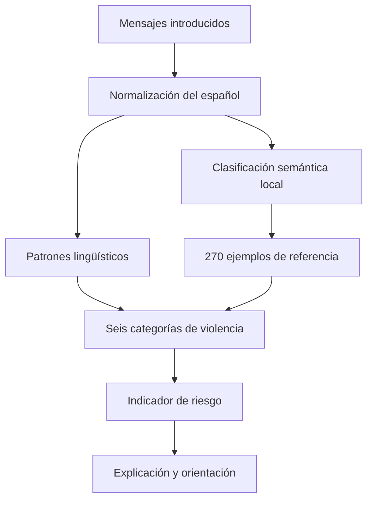

# Love or Control?

### Asistente privado para identificar control coercitivo y violencia en relaciones afectivas

> **La violencia no siempre comienza con un golpe. A veces comienza con una exigencia, una amenaza, una contraseña o una frase que te hace creer que todo es tu culpa.**

**Love or Control?** es un prototipo de aplicación web que analiza conversaciones en español para identificar indicadores de violencia, explicar por qué determinadas expresiones son preocupantes y ofrecer orientación inicial con enfoque psicológico, de género y diversidad.

El procesamiento de los mensajes se realiza localmente en el navegador mediante un clasificador semántico y reglas lingüísticas. La aplicación no necesita enviar las conversaciones analizadas a un servicio de inteligencia artificial externo.

**Proyecto:** Team Comadres · Cuenca, Ecuador  
**Contexto:** Aleph Hackathon · Track QVAC  
**Estado:** MVP funcional  
**Idioma principal:** español

## Demostración

**Aplicación:** https://love-or-control-qvac.eva-karina.chatgpt.site

> La disponibilidad de la demostración puede depender de los permisos configurados para el sitio.

## El problema

Las señales de violencia en una relación suelen normalizarse, justificarse o confundirse con preocupación, amor, protección o celos. El control digital, el aislamiento, la culpabilización, la coerción sexual y las amenazas pueden aparecer antes de que la persona identifique la situación como violencia.

Además, solicitar que conversaciones íntimas se envíen a servidores externos puede generar riesgos adicionales de privacidad, exposición y vigilancia, especialmente cuando otra persona controla el dispositivo o conoce las credenciales de acceso.

Love or Control? responde a ambos problemas mediante una lectura explicable de patrones de riesgo y un enfoque de procesamiento local.

## Funcionalidades

- Análisis local de conversaciones escritas o copiadas por la persona usuaria.
- Clasificación de indicadores en seis categorías de violencia.
- Base de **270 ejemplos de referencia** organizados originalmente en nueve grupos y consolidados en seis familias analíticas.
- Reconocimiento semántico de expresiones nuevas, no limitado a coincidencias textuales exactas.
- Normalización de mayúsculas, tildes, puntuación, fechas y formatos frecuentes de conversaciones de WhatsApp.
- Reconocimiento de conjugaciones, tiempos verbales, subjuntivo, condicional y construcciones perifrásticas en español.
- Priorización de amenazas físicas explícitas y amenazas que desplazan la responsabilidad hacia la víctima.
- Indicador orientativo de riesgo con puntuación y cuatro niveles.
- Explicación de los patrones encontrados y presentación del fragmento relevante.
- Orientación inicial de apoyo adaptada a la conversación.
- Mensajes de validación, autonomía y seguridad.
- Salida rápida mediante botón o tecla `Esc`, con limpieza del estado visible y apertura de una pantalla neutra.
- Eliminación manual de la información visible de la sesión.
- Interfaz adaptable a celulares y computadoras.

### Mensajes de acompañamiento

La pantalla inicial evita conversaciones de prueba con contenido violento y presenta mensajes de apoyo:

- **No es tu culpa.**
- **Lo que sientes importa.**
- **Tu seguridad es primero.**
- **Mereces respeto y libertad.**

## Seis categorías de violencia

| Categoría | Qué identifica |
| --- | --- |
| **Control digital y celos coercitivos** | Vigilancia, exigencia de respuestas inmediatas, ubicación, contraseñas, acceso al teléfono o supervisión de redes. |
| **Aislamiento y restricción de redes** | Intentos de limitar amistades, vínculos familiares, terapia, estudio, trabajo o participación comunitaria. |
| **Violencia psicológica y gaslighting** | Culpabilización, humillación, invalidación, manipulación, castigo emocional y distorsión de lo ocurrido. |
| **Violencia sexual, reproductiva y por identidad** | Coerción sexual, presión reproductiva, difusión de contenido íntimo y amenazas de revelar orientación sexual o identidad de género. |
| **Violencia económica y patrimonial** | Control de ingresos, apropiación de bienes, retención de documentos, deudas forzadas y destrucción de pertenencias. |
| **Amenazas, intimidación y violencia física** | Amenazas de agresión, muerte, represalias, persecución, daño a terceros y autolesión utilizada como mecanismo de coerción. |

## Cómo funciona el análisis

La aplicación combina tres mecanismos complementarios:

1. **Ejemplos de referencia:** contrasta el texto con una base de 270 expresiones previamente organizadas por categoría.
2. **Patrones lingüísticos:** reconoce expresiones de control, coerción, intimidación y violencia mediante reglas específicas.
3. **Clasificación semántica local:** normaliza el lenguaje, identifica raíces y sinónimos, construye características ponderadas y compara el contenido con los ejemplos mediante similitud coseno.



El motor contempla variaciones como:

```text
te golpeo
te golpeé
te golpearé
te golpearía
te golpee
voy a golpearte
terminaría golpeándote
me obligas a que luego te golpee
```

La frase:

```text
¡Contéstame! Me obligas a que luego te golpee.
```

puede activar simultáneamente indicadores de:

- Control digital y exigencia coercitiva de respuesta.
- Violencia psicológica mediante culpabilización.
- Amenaza de violencia física.

El resultado correspondiente se clasifica como **riesgo alto**, con una puntuación orientativa de **95/100** en la configuración actual.

## Niveles orientativos de riesgo

| Nivel | Interpretación | Respuesta general |
| --- | --- | --- |
| **Verde** | En el fragmento analizado no se identifican indicadores suficientes. | Información preventiva y reconocimiento de límites personales. |
| **Amarillo** | Aparecen señales iniciales que requieren atención. | Reflexión sobre el patrón y búsqueda segura de apoyo. |
| **Naranja** | Se identifican señales relevantes de coerción o violencia. | Consideración de medidas de protección y orientación especializada. |
| **Rojo** | Existen amenazas graves, múltiples indicadores o posible riesgo inmediato. | Priorización de la seguridad y acceso a ayuda cuando hacerlo no aumente el riesgo. |

> Un resultado verde **no significa que la relación sea segura**. La aplicación únicamente interpreta los mensajes proporcionados y no conoce el contexto completo.

## Privacidad y seguridad

### Implementado actualmente

- El análisis de las conversaciones se ejecuta en el navegador.
- Los mensajes introducidos para su evaluación no se envían a un proveedor externo de inteligencia artificial.
- La aplicación mantiene la información visible en el estado de la sesión.
- La salida rápida elimina los mensajes y resultados visibles antes de mostrar una pantalla neutra.
- El botón **Borrar todo** limpia la información visible de la sesión.
- El asistente no contacta automáticamente a instituciones, familiares ni terceros.

### Límites importantes

- El prototipo **no implementa actualmente** cifrado de evidencia, almacenamiento seguro persistente, PIN independiente ni protección biométrica.
- La pantalla neutra ayuda a reducir exposición casual, pero no garantiza protección frente a vigilancia del dispositivo, capturas, historial del navegador o software espía.
- El procesamiento puede continuar sin conexión cuando la aplicación y sus recursos ya están disponibles en el navegador; esto no equivale a garantizar funcionamiento offline desde cero ni a contar con una PWA instalada.
- Las llamadas, mensajes externos y consultas a servicios de emergencia requieren las condiciones de conectividad correspondientes.
- Antes de utilizar el proyecto con datos reales, deben evaluarse formalmente sus riesgos de seguridad, privacidad y protección de datos.

## Relación con QVAC

La propuesta se alinea con el enfoque de privacidad, autonomía y procesamiento local del track QVAC.

Sin embargo, es necesario distinguir entre el estado actual y el trabajo futuro:

> **El SDK de QVAC no está integrado en esta versión.** El MVP utiliza un clasificador semántico local propio, ejecutado en el navegador.

La integración futura con QVAC permitiría explorar:

- Ejecución de modelos locales especializados.
- Análisis contextual más avanzado.
- Acompañamiento conversacional mediante modelos ejecutados en el dispositivo.
- Consulta local de recursos mediante recuperación documental.
- Procesamiento local de capturas o audios, sujeto a validación técnica.

Ninguna de estas capacidades debe presentarse como implementada hasta que exista una integración verificable.

## Tecnologías

| Componente | Tecnología |
| --- | --- |
| Interfaz | React 19 y TypeScript |
| Framework | Next.js 16 sobre Vinext |
| Herramienta de construcción | Vite 8 |
| Clasificación | Reglas lingüísticas, normalización, raíces verbales y similitud coseno |
| Pruebas | `node:test` y `node:assert/strict` |
| Entorno de ejecución | Node.js 22.13 o superior |
| Despliegue | Aplicación compatible con Cloudflare Workers |

## Requisitos

- Node.js `>=22.13.0`.
- npm compatible con la versión de Node.js instalada.
- Git, si se desea clonar el repositorio.
- Para los scripts de construcción incluidos: Linux o un entorno compatible con Bash, `flock` y GNU `timeout`.

> En Windows puede utilizarse WSL. En macOS, algunos scripts pueden requerir adaptar las herramientas GNU utilizadas por el proyecto.

## Instalación

### 1. Clonar el repositorio

```bash
git clone https://github.com/TU-USUARIO/love-or-control.git
cd love-or-control
```

Reemplaza `TU-USUARIO` y el nombre del repositorio por los datos reales de tu cuenta u organización.

### 2. Instalar dependencias

```bash
npm ci
```

Si no dispones del archivo de bloqueo correspondiente:

```bash
npm install
```

### 3. Iniciar el entorno de desarrollo

```bash
npm run dev
```

Abre en tu navegador la dirección local que muestre Vite.

## Comandos disponibles

```bash
# Iniciar el servidor de desarrollo.
npm run dev

# Crear la versión de producción.
npm run build

# Ejecutar la aplicación compilada.
npm run start

# Compilar y ejecutar todas las pruebas.
npm test

# Ejecutar únicamente las pruebas del motor de análisis.
node --test tests/safety-analysis.test.mjs

# Revisar el código con ESLint.
npm run lint
```

## Estructura principal

| Archivo o directorio | Función |
| --- | --- |
| `app/page.tsx` | Interfaz principal, análisis de conversaciones, mensajes de apoyo, asistente y salida rápida. |
| `app/globals.css` | Estilos visuales y adaptación a dispositivos móviles. |
| `app/layout.tsx` | Configuración general y metadatos de la aplicación. |
| `app/safety-analysis.ts` | Reglas, categorías, puntuación de riesgo y respuestas de orientación. |
| `app/semantic-classifier.ts` | Normalización, análisis semántico, sinónimos, raíces y similitud entre mensajes. |
| `app/spanish-violence-language.ts` | Detección de verbos asociados con violencia y sus variaciones en español. |
| `app/violence-reference.ts` | Base de 270 ejemplos de referencia. |
| `tests/safety-analysis.test.mjs` | Pruebas del motor de detección, categorías, amenazas y conjugaciones. |
| `tests/rendered-html.test.mjs` | Verificación del contenido generado y de la interfaz inicial. |
| `worker/index.ts` | Punto de entrada para el entorno de despliegue. |
| `vite.config.ts` | Configuración de Vite y de la construcción de la aplicación. |
| `package.json` | Dependencias, scripts y requisitos de ejecución. |

## Validación

La versión actual superó **33 pruebas automatizadas**, que incluyen:

- Reconocimiento de los 270 ejemplos de referencia.
- Consolidación de nueve grupos originales en seis categorías.
- Identificación de amenazas físicas como riesgo alto.
- Reconocimiento de amenazas directas e indirectas.
- Detección de culpabilización asociada con agresiones.
- Interpretación de tiempos verbales, subjuntivo, condicional y perífrasis.
- Identificación de outing y violencia por identidad.
- Reconocimiento de coerción económica y patrimonial.
- Procesamiento de mensajes con formatos habituales de WhatsApp.
- Prevención de falsos positivos en solicitudes respetuosas y conversaciones consensuadas.
- Verificación de mensajes de apoyo y ausencia de conversaciones de prueba en la pantalla inicial.

Para ejecutar la validación completa:

```bash
npm test
```

> Estas pruebas verifican el comportamiento del prototipo y sus casos definidos. No sustituyen una validación clínica, psicométrica, poblacional ni de seguridad informática.

## Principios de diseño

1. **Privacidad:** los mensajes sensibles no deben salir del entorno local para obtener una primera orientación.
2. **No revictimización:** la aplicación evita atribuir responsabilidad a quien experimenta violencia.
3. **Autonomía:** no denuncia, contacta ni toma decisiones por la persona usuaria.
4. **Seguridad contextual:** buscar ayuda, confrontar o terminar una relación puede implicar riesgos diferentes según cada situación.
5. **Explicabilidad:** cada indicador debe acompañarse de una explicación comprensible.
6. **Diversidad:** se contemplan relaciones no heteronormativas y amenazas asociadas con orientación sexual e identidad de género.
7. **Honestidad técnica:** las funciones futuras y la integración pendiente de QVAC se diferencian de las capacidades existentes.

## Hoja de ruta

- Integrar efectivamente el SDK de QVAC.
- Evaluar modelos locales especializados en violencia de género y control coercitivo.
- Ampliar el corpus con expresiones ecuatorianas y latinoamericanas.
- Realizar validación interdisciplinaria con profesionales de psicología, seguridad digital y derechos humanos.
- Medir sensibilidad, especificidad, falsos positivos y falsos negativos con datos revisados por especialistas.
- Incorporar recursos de ayuda territorialmente verificados.
- Evaluar almacenamiento local cifrado y mecanismos de acceso seguro.
- Diseñar rutas de apoyo inclusivas para personas LGBTQ+.
- Explorar OCR y transcripción local de audios.
- Implementar una evaluación formal de riesgos, privacidad y accesibilidad.

## Advertencia de uso

Love or Control? es una herramienta orientativa y preventiva. No constituye diagnóstico psicológico, evaluación forense, predicción de feminicidio, asesoramiento jurídico ni sustituto de atención profesional.

Si existe peligro inmediato en Ecuador y hacerlo no aumenta tu exposición, puedes comunicarte con el **ECU 911** o buscar apoyo de una persona de confianza.

## Equipo

**Team Comadres** · Cuenca, Ecuador.

- **Eva Karina Peña Contreras:** enfoque psicológico, prevención de violencia, perspectiva de género y criterios éticos.
- **Rocío González Toral:** desarrollo tecnológico, privacidad y estrategia técnica.

## Licencia

La licencia del proyecto debe definirse antes de su publicación o distribución. Hasta que exista un archivo `LICENSE`, no debe asumirse que el código se encuentra bajo una licencia de software libre específica.

---

**Tu historia te pertenece. Tu seguridad importa. El control no es amor.**